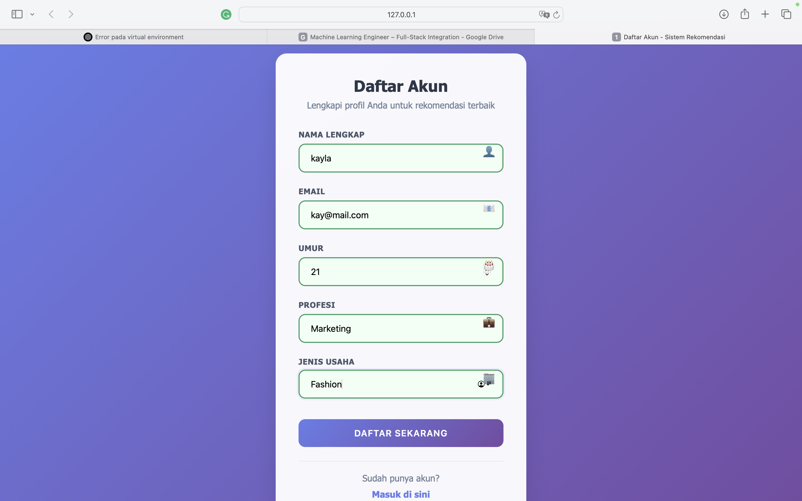
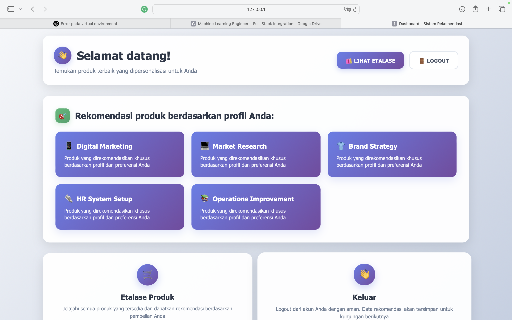
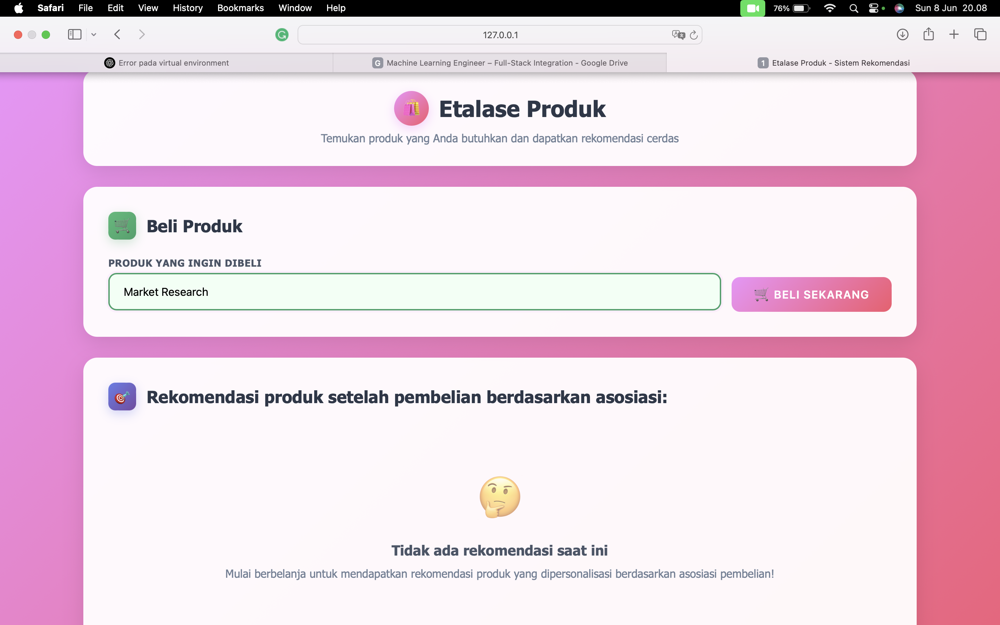

## Sistem Rekomendasi Produk Otomatis

### 📌 Deskripsi
Sistem ini merekomendasikan produk untuk pengguna berdasarkan:
- Profil pengguna (usia, profesi, jenis usaha)
- Riwayat pembelian pengguna (produk yang dibeli sebelumnya)

### 🧰 Teknologi
- Python (pandas, scikit-learn, mlxtend, joblib)
- HTML + CSS (Frontend)
- Flask (opsional integrasi backend)

### 🔁 Alur Kerja
1. Registrasi & input data pengguna
2. Login → munculkan rekomendasi awal (Content-Based)
3. Simulasi pembelian → munculkan rekomendasi lanjutan (Apriori)

### ScreenShot

